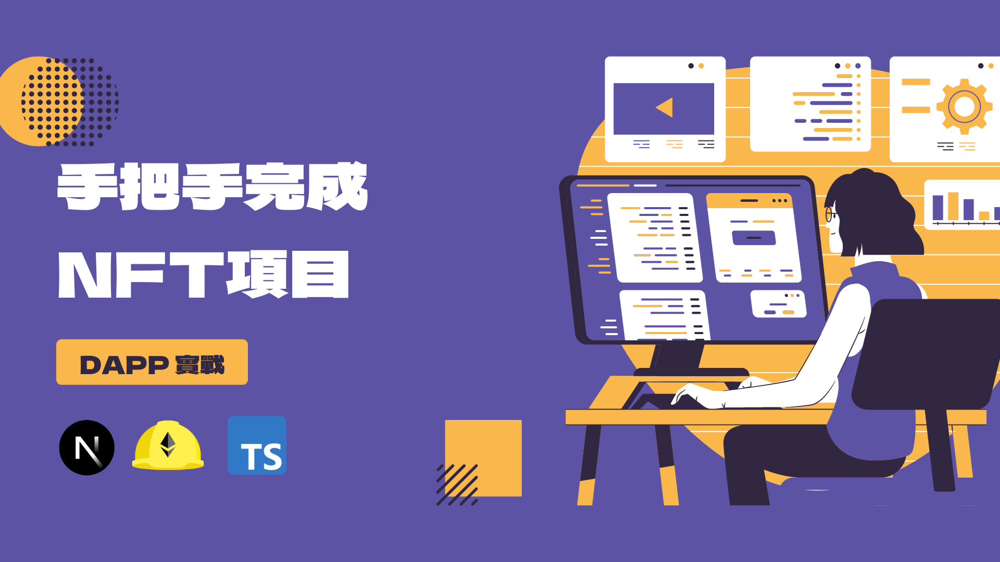

# 課程講義



## 使用方法

首先：安裝 [NVM](https://github.com/nvm-sh/nvm?tab=readme-ov-file#installing-and-updating) 並安裝 Node.js v18 以上版本

> Windows 使用者請安裝 [nvm-windows](https://github.com/coreybutler/nvm-windows?tab=readme-ov-file#install-nvm-windows)

檢查 Node.js 版本

```bash
node -v
# v18.18.1
```

再來：使用 `npm i` 安裝專案所需套件

最後：使用 `npm run dev` 啟動開發伺服器，並在瀏覽器中開啟 http://localhost:8888
